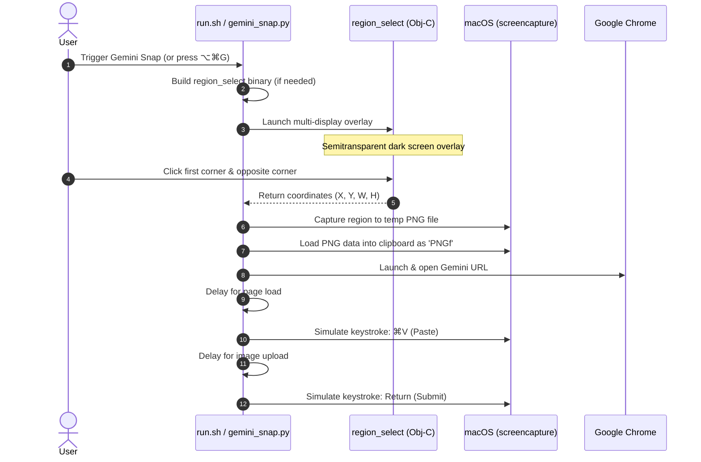

# Gemini Snap

> Two-click screen region capture ➔ Instantly open in Gemini ➔ Auto-paste & submit in Google Chrome.

Gemini Snap is a fast macOS productivity tool designed to streamline sending visual context to Google Gemini. Instead of manually taking a screenshot, opening a browser, navigating to Gemini, and pasting the file, Gemini Snap does all of this in a single action.

---

## How It Works



---

## Quick Start

### 1. Make executable
Configure executable permissions on the launcher:
```bash
chmod +x run.sh
```

### 2. Run standard capture
```bash
./run.sh
```
1. Click once for the first corner of your target region.
2. Move your cursor to the opposite corner (a blue outline guides you).
3. Click again to confirm (or press Esc to cancel).
4. Google Chrome will automatically open Gemini, paste the screenshot, and submit it.
(Note: On the first run, the script will automatically compile the native selector binary).

### 3. Dry-run (Copy to clipboard only)
If you only want the screenshot copied to your clipboard without opening Chrome or pasting:
```bash
./run.sh --dry-run
```

---

## Configuration and Flags

Customize the behavior of Gemini Snap using the following CLI flags:

| Flag | Default | Description |
|---|---|---|
| `--browser <name>` | `Google Chrome` | Target browser app to open Gemini (e.g. `Arc`, `Brave Browser`, `Google Chrome`). |
| `--rebuild` | *None* | Force recompiling the native Objective-C region selector overlay binary. |
| `--dry-run` | *None* | Perform capture and copy to clipboard, but do not open browser/Gemini. |
| `--no-submit` | *None* | Open Gemini and paste the screenshot, but do not simulate the final `Return` key press. |
| `--load-wait <seconds>` | `2.5` | Duration (in seconds) to wait for the Gemini web app to load before pasting. |
| `--paste-wait <seconds>` | `1.5` | Duration (in seconds) to wait for the image upload to attach before submitting. |
| `--save <path>` | *None* | Keep the captured PNG saved at a specific file path (by default, it uses a temporary directory). |
| `--rect <x,y,w,h>` | *None* | Capture a predefined screen coordinate rectangle instantly without prompt. |

---

## Global Keyboard Shortcut (Optional)

You can configure a global hotkey (such as `⌥⌘G` / Option + Command + G) to trigger Gemini Snap from anywhere in macOS using the built-in **Shortcuts** app:

1. Open **Shortcuts.app** on your Mac.
2. Click **+** in the top-right to create a new shortcut.
3. Search for the **"Run Shell Script"** action in the list on the right and drag it into the shortcut.
4. Set the command path to point to your script:
   ```bash
   /bin/bash /absolute/path/to/gemini-snap/run.sh
   ```
5. In the right-hand settings panel (under Shortcut Details / Info icon):
   * Check **Use as Quick Action**.
   * Click **Add Keyboard Shortcut** and press **Option + Command + G** (`⌥⌘G`).

